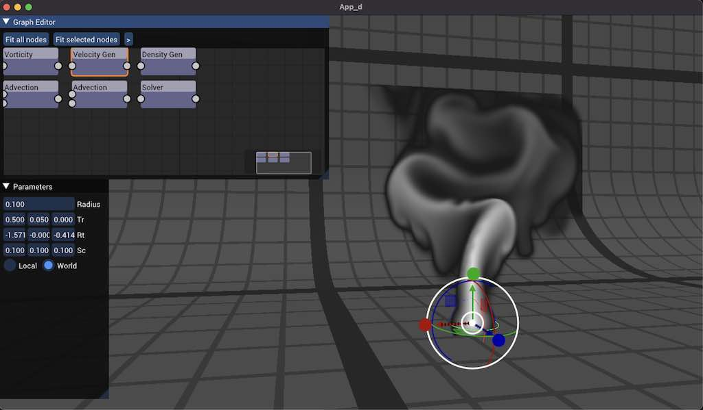

# Flooid

Linux [](https://cedricguillemet.visualstudio.com/Flooid/_build/latest?definitionId=5&branchName=main)
Emscripten [](https://cedricguillemet.visualstudio.com/Flooid/_build/latest?definitionId=5&branchName=main)

MacOS [](https://cedricguillemet.visualstudio.com/Flooid/_build/latest?definitionId=5&branchName=main)
Windows [](https://cedricguillemet.visualstudio.com/Flooid/_build/latest?definitionId=5&branchName=main)


Flooid is a node based fluid simulator. 
Made with love and C++ !



To build it, you'll need CMake and your C++ compiler of choice (emsdk for web build). 

## Build

Binary output directory is `bin/`

### Clone repo
```
git clone https://github.com/CedricGuillemet/bam.git --recurse-submodules
```

### Windows
```
mkdir build
cd build
cmake .. -G "Visual Studio 16 2019" -A x64
```
And open .sln with Visual Studio

### Mac
```
mkdir build
cd build
cmake .. -G Xcode
```

And open project with Xcode

### Linux
```
mkdir build
cd build
cmake .. -G Ninja
ninja
```

### Web

Clone and activate emsdk https://github.com/emscripten-core/emsdk
Install your favorite build tool supported by cmake (ninja, make, ...)
```
mkdir build
cd build
emcmake cmake .. -G Ninja -DCMAKE_BUILD_TYPE=Release
ninja
```
#### Test web

In `bin` folder:

```
python3 -m http.server
```

## Proudly using

https://github.com/CedricGuillemet/bam
https://github.com/ocornut/imgui/
https://github.com/CedricGuillemet/Immath/
https://github.com/CedricGuillemet/ImGuizmo
https://github.com/bkaradzic/bgfx